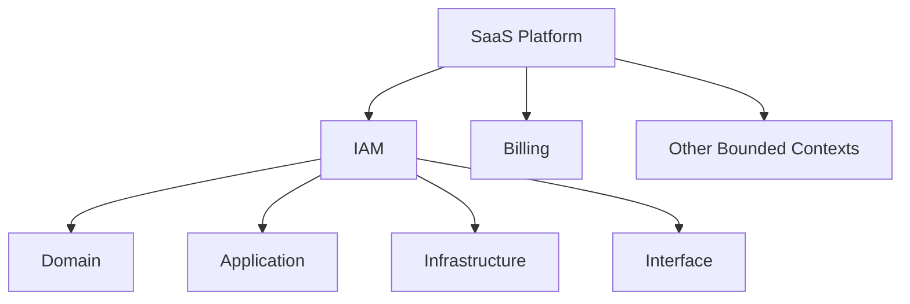
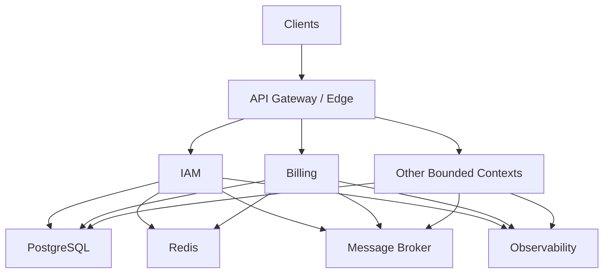
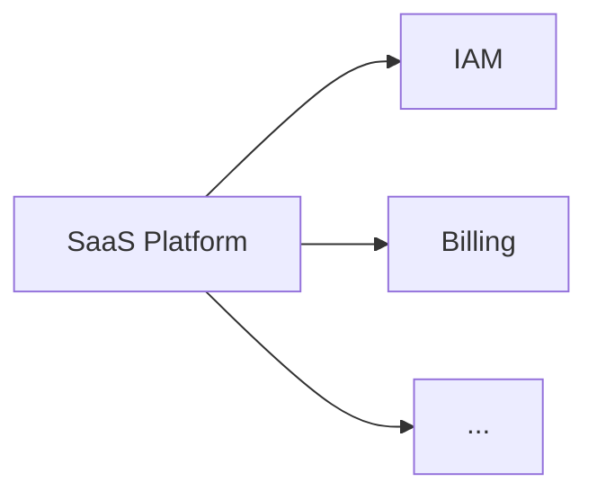
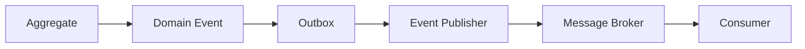

# Architecture

## 1. Overview

The platform follows Domain-Driven Design (DDD), layered architecture,
and dependency inversion principles.

Business capabilities are organized into bounded contexts. Each bounded
context owns its domain model and application behavior while depending
on technical infrastructure through explicit contracts.



## 2. Architectural Principles

- Domain logic must remain independent of infrastructure.
- Application services orchestrate domain behavior.
- Infrastructure implements domain/application contracts.
- Interfaces translate external protocols into application requests.
- Aggregates enforce transactional consistency boundaries.
- Value objects encapsulate domain concepts and validation.
- Domain events represent meaningful domain state changes.
- Bounded contexts own their domain models.
- Cross-context communication occurs through explicit contracts.
- Business logic must not depend on frameworks.

## 3. System Architecture



## 4. Domain Architecture

```shell
domain/
├── aggregates/
├── entities/
├── value_objects/
├── repositories/
├── services/
├── events/
├── enums/
└── exceptions/
```

## 5. Application Architecture

```shell
application/
├── commands/
├── queries/
├── dto/
├── use_cases/
├── interfaces/
└── exceptions/
```

## 6. Infrastructure Architecture

```shell
infrastructure/
├── persistence/
├── security/
├── messaging/
└── cache/
```

## 7. Interface Architecture

```shell
interface/
├── http/
├── cli/
└── events/
```

## 8. Dependency Rules

## 9. Project Structure

## 10. Bounded Contexts



| Context | Responsibility                                              |
| ------- | ----------------------------------------------------------- |
| IAM     | Identity, authentication, authorization, sessions, API keys |
| Billing | Subscriptions, plans, invoices, payments                    |
| ...     | ...                                                         |

## 11. Inter-Module Communication

Synchronous
    HTTP / RPC

Asynchronous
    Domain Events
    Integration Events
    Message Broker

## 12. Data Architecture

Bounded Context
      │
      ▼
Owns its data
      │
      ▼
Repository abstraction
      │
      ▼
Infrastructure implementation
      │
      ▼
PostgreSQL

Then explain things such as:
- database ownership
- transactions
- migrations
- outbox
- idempotency
- read models
- caching

## 13. Event Architecture



## 14. Cross-Cutting Concerns

- Observability
- Logging
- Metrics
- Tracing
- Configuration
- Secrets
- Authentication
- Authorization
- Error handling
- Resilience
- Health checks

## 15. Testing Architecture

Domain
    → Unit tests

Application
    → Use-case tests
    → Contract tests

Infrastructure
    → Integration tests

Interface
    → API / end-to-end tests
