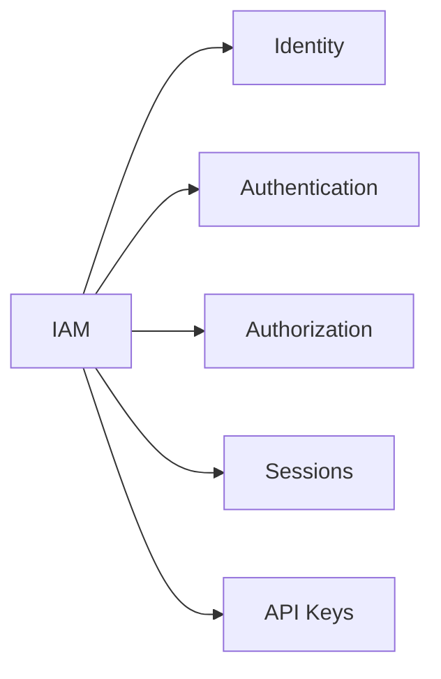
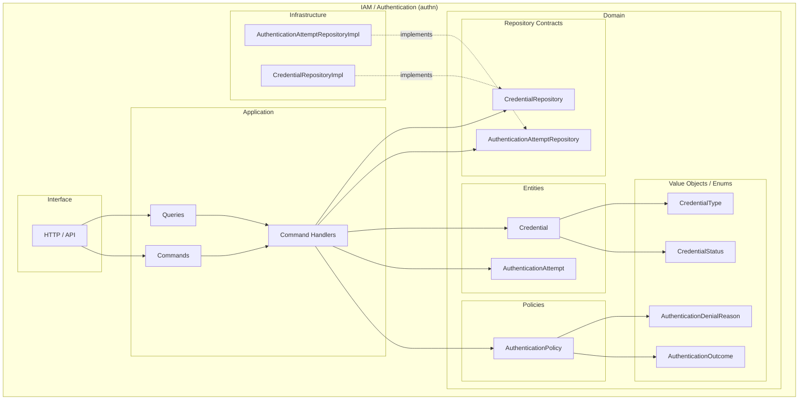

## Architecture Diagram

```mermaid
graph LR
    %% Bounded Contexts
    IAM["IAM"]

    IAM --> Identity["Identity"]
    IAM --> Authentication["Authentication"]
    IAM --> Authorization["Authorization"]
    IAM --> Sessions["Sessions"]
    IAM --> APIKeys["API Keys"]
```

### Authentication

```mermaid
flowchart TB
    subgraph AUTHN["IAM / Authentication (authn)"]

        subgraph Interface["Interface"]
            HTTP["HTTP / API"]
        end

        subgraph Application["Application"]
            Commands["Commands"]
            Handlers["Command Handlers"]
            Queries["Queries"]
        end

        subgraph Domain["Domain"]
            subgraph Entities["Entities"]
                AuthenticationAttempt["AuthenticationAttempt"]
                Credential["Credential"]
            end

            subgraph Policies["Policies"]
                AuthenticationPolicy["AuthenticationPolicy"]
            end

            subgraph ValueObjects["Value Objects / Enums"]
                AuthenticationOutcome["AuthenticationOutcome"]
                AuthenticationDenialReason["AuthenticationDenialReason"]
                CredentialStatus["CredentialStatus"]
                CredentialType["CredentialType"]
            end

            subgraph Contracts["Repository Contracts"]
                AuthenticationAttemptRepository["AuthenticationAttemptRepository"]
                CredentialRepository["CredentialRepository"]
            end
        end

        subgraph Infrastructure["Infrastructure"]
            AuthAttemptRepoImpl["AuthenticationAttemptRepositoryImpl"]
            CredentialRepoImpl["CredentialRepositoryImpl"]
        end

        HTTP --> Commands
        HTTP --> Queries

        Commands --> Handlers
        Queries --> Handlers

        Handlers --> AuthenticationPolicy
        Handlers --> AuthenticationAttempt
        Handlers --> Credential

        AuthenticationPolicy --> AuthenticationOutcome
        AuthenticationPolicy --> AuthenticationDenialReason
        Credential --> CredentialStatus
        Credential --> CredentialType

        Handlers --> AuthenticationAttemptRepository
        Handlers --> CredentialRepository

        AuthAttemptRepoImpl -. implements .-> AuthenticationAttemptRepository
        CredentialRepoImpl -. implements .-> CredentialRepository
    end
```